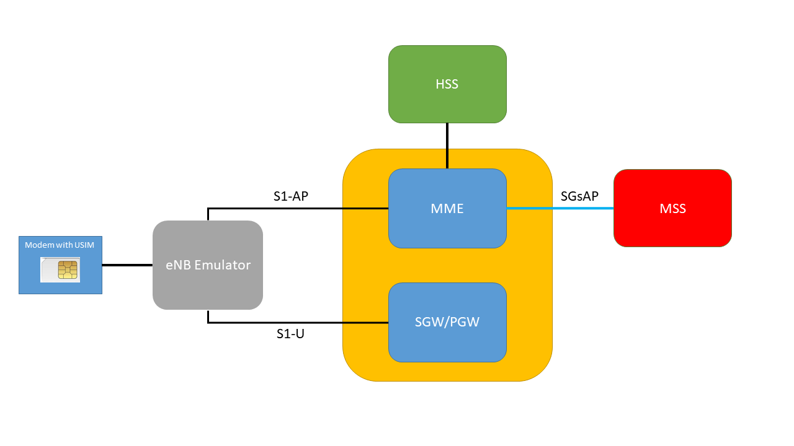

# SGs
Minimal MSS SGs Server

This is a MSS SGs SCTP Server written in python3 that can be used with a MME to test some SGs features, like IMSI Attach, Location Update, SMS (Sending/Receiving/Alerting) or Paging (for SMS or CS-Fallback).

It is suitable to be used with one MME (only accepts the first SCTP connection) and one user (one IMSI/MSISDN). It can be easily changed to become a more functional MSS SGs server handling multiple SCTP connections and multiple users at the same time, but that is not currently supported.

I built this application to use it with my eNB app (that only supports one user) and an MME (which has the SGs configured to this SGs server).

<p align="center"></p>

In case of multiple users, the application will handle all messages initiated by the MME without any limitation.
The only issue is the MSS SGs initiated procedures, in which there is a need to use an IMSI or TMSI. In those scenarios, the last received IMSI/TMSI will be used.

These are all the current SGs messages defined in 3GPP 29.118 specification:
(not all of these messages are supported by the application)

```
#   SGs Messages Codes (29.118):
#
#1 SGsAP-PAGING-REQUEST               - from MSS to MME: Request <<<<<< ------------------- Can by sent by this app
#2 SGsAP-PAGING-REJECT                - from MME to MSS: Answer to 1 (no success)
#6 SGsAP-SERVICE-REQUEST              - from MME to MSS: Answer to 1 (success)
#7 SGsAP-DOWNLINK-UNITDATA            - from MSS to MME  <<<<<< --------------------------- Can by sent by this app
#8 SGsAP-UPLINK-UNITDATA              - from MME to MSS  >>>>>> --------------------------- Processed by this app
#9 SGsAP-LOCATION-UPDATE-REQUEST      - from MME to MSS: Request -------------------------- Processed by this app
#10 SGsAP-LOCATION-UPDATE-ACCEPT      - from MSS to MME: Answer to 9 (success)
#11 SGsAP-LOCATION-UPDATE-REJECT      - from MSS to MME: Answer to 9 (no success)
#12 SGsAP-TMSI-REALLOCATION-COMPLETE  - from MME to MSS: Answer to 10 (confirm new tmsi)
#13 SGsAP-ALERT-REQUEST..             - from MSS to MME: Request <<<<<< ------------------- Can by sent by this app
#14 SGsAP-ALERT-ACK                   - from MME to MSS: Answer to 13 (success)
#15 SGsAP-ALERT-REJECT                - from MME to MSS: Answer to 13 (no success)
#16 SGsAP-UE-ACTIVITY-INDICATION      - from MME to MSS: 
#17 SGsAP-EPS-DETACH-INDICATION       - from MME to MSS: Request >>>>>>
#18 SGsAP-EPS-DETACH-ACK              - from MSS to MME: Answer to 17
#19 SGsAP-IMSI-DETACH-INDICATION      - from MME to MSS: Request >>>>>>
#20 SGsAP-IMSI-DETACH-ACK             - from MSS to MME: Answer to 19
#21 SGsAP-RESET-INDICATION            - from MSS to MME: Request <<<<<< ------------------- Can by sent by this app
#22 SGsAP-RESET-ACK                   - from MME to MSS: Answer to 21
#23 SGsAP-SERVICE-ABORT-REQUEST       - from MSS to MME: 
#24 SGsAP-MO-CSFB-INDICATION          - from MME to MSS: 
#26 SGsAP-MM-INFORMATION-REQUEST      - from MMS to MME: Request <<<<<< ------------------- Can by sent by this app (sent in Location-Update procedure)
#27 SGsAP-RELEASE-REQUEST             - from MSS to MME
#29 SGsAP-STATUS                      - from MSS to MME:
#31 SGsAP-UE-UNREACHABLE              - from MME to MSS:

```

To start the application the only option we need to specify is the server IP:

```
root@ubuntu# python3 sctp_sgs.py -h
Usage: sctp_sgs.py [options]

Options:
  -h, --help            show this help message and exit
  -i MSS_IP, --ip=MSS_IP
                        MSS Local IP Address
root@ubuntu# 
```

When the application is started, these are the options available (as soon the MME establishes the SCTP connection with the server):

```
Choose one of the options:

	1. SMS Paging
	2. CS Paging
	3. Send SMS
	4. Send Alert
	5. Send Reset


	q. Quit

```

There are two variables in the code where we can define the MSS name and the operator name that is sent in the MM-INFORMATION-REQUEST.

This application only used modules from the python standard library.
